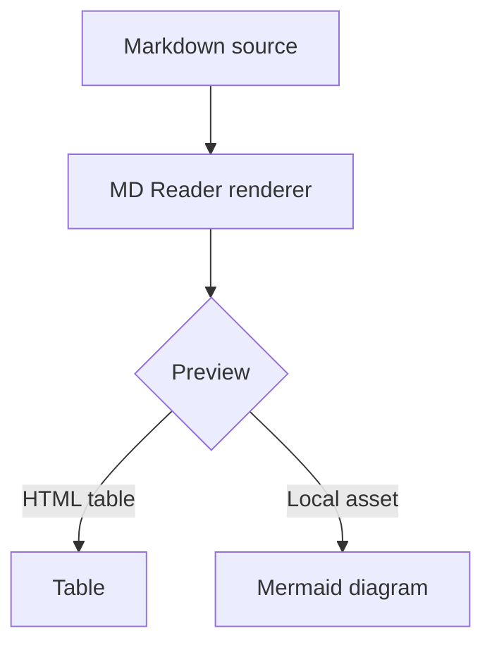

# Markdown Showcase

This fixture intentionally exercises the Markdown features MD Reader is expected to render.
It should stay stable so rendering regressions are easy to spot.

## Inline Formatting

Plain paragraph text with a hard break at the end of this line.  
This sentence should appear on the next visual line.

Escaped Markdown characters: \*literal asterisks\*, \_literal underscores\_, and \[literal brackets\].

This paragraph includes **bold text**, *italic text*, ***bold italic text***, `inline code`, and ~~strikethrough if supported by the renderer~~.

### Links And Images

[Safe HTTPS link](https://example.com)

[Relative link](./related-document.md)


#### Lists

- Unordered item one
- Unordered item two
  - Nested unordered item
  - Another nested unordered item
- Unordered item three

1. Ordered item one
2. Ordered item two
   1. Nested ordered item
   2. Another nested ordered item
3. Ordered item three

- [ ] Open task item
- [x] Completed task item

##### Quotes And Rules

> A blockquote should be visibly indented.
>
> > Nested quote text should remain inside the quote structure.

---

###### Code

```python
def greet(name: str) -> str:
    return f"Hello, {name}!"
```

```
Plain fenced code
with multiple lines.
```

    Indented code line one
    Indented code line two

## Tables

| Feature | Status | Notes |
| :--- | :---: | ---: |
| Headings | Pass | Six levels |
| Tables | Pass | Alignment markers |
| Mermaid | Pass | Local bundle |

## Mermaid



## Unsafe HTML Samples

<script>window.__mdreader_unsafe_script_executed = true</script>

<iframe src="https://example.com"></iframe>

<object data="https://example.com"></object>

[Unsafe JavaScript link](javascript:alert('unsafe'))

"></svg>)

## Unicode And Wrapping

Unicode sample: café, naïve, 東京, Manila, emoji-like text intentionally omitted from assertions.

This is a deliberately long paragraph intended to verify wrapping behavior in the preview pane without forcing horizontal page scrolling or overlapping neighboring content in the split editor layout. The line should remain readable even when the application window is narrowed.
